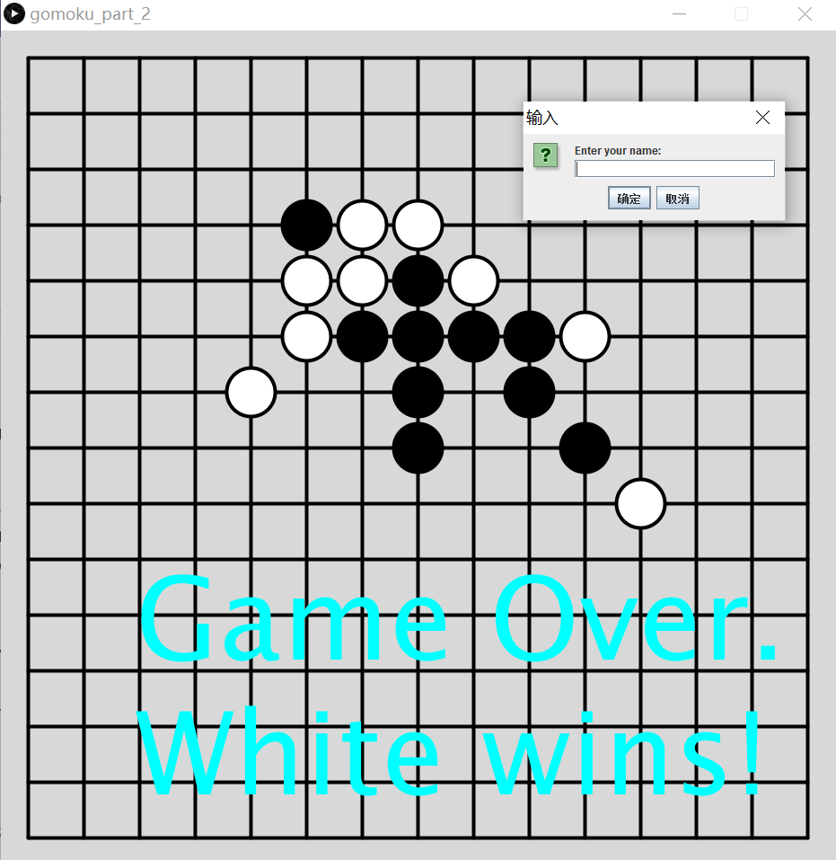

# Gomoku Game

A strategic Gomoku game powered by Python, featuring a heuristic-based AI that excels in pattern recognition, threat assessment, and defensive strategies. Experience challenging gameplay against an AI that adapts, offering a dynamic difficulty curve that will test the skills of both beginners and seasoned players.

  

## AI (ComputerPlayer Class) Overview

The AI in this game is not just a basic random move generator. It uses a heuristic evaluation function designed to enhance the AI's decision-making abilities. This function evaluates patterns, threats, and defensive moves assigning different weights to each.

### Features of AI:

- **Heuristic Evaluation**: AI calculates scores based on potential patterns, offensive and defensive opportunities, prioritizing certain moves.
- **Pattern Recognition**: Evaluates the board for 2, 3, or more consecutive stones to determine the most advantageous move.
- **Threat Assessment**: Identifies potential winning moves for the opponent and blocks them.
- **Defensive Play**: Looks for opportunities to secure its own potential winning moves.

### Pick Next Move Algorithm:

The AI's move is determined by the empty spot with the highest heuristic score, making it a 'smart' opponent that is challenging to beat.

### Adjusting Difficulty:

Future enhancements could include adjustable difficulty by modifying the weights in the heuristic evaluation function.

### Future Improvements:

Further development could aim to enable the AI to set traps by creating patterns that lead to two potential winning moves, ensuring victory.

## Getting Started

To run the game, you will need Python and the Processing library installed on your system.

### Prerequisites

- Python
- Processing

### Installation

1. Clone the repository to your local machine.
2. Ensure you have the required prerequisites installed.
3. Run the `gomoku.pyde` file to start the game.
